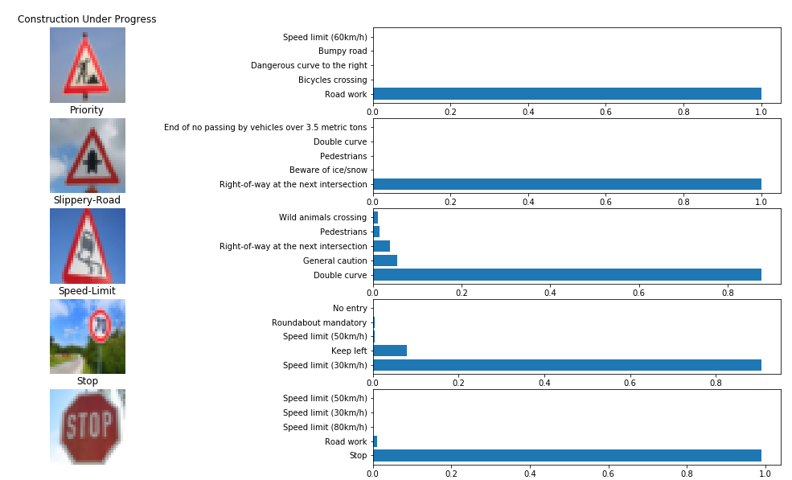

## Project: Build a Traffic Sign Recognition Program

The project uses  deep neural networks and convolutional neural networks to classify traffic signs. 
The training and validation of the model is done using the traffic sign images from German Traffic Sign Dataset.
It uses tensorflow and scikit-learn libraries.

For detailed explanation please refer [Traffic Sign Classifier](Traffic_Sign_Classifier.pdf).
